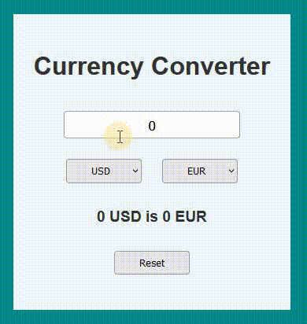

# React - Currency converter

# 🔗 [Live Preview](https://stupendous-kitten-1092ee.netlify.app/)

---

## About 👋

This is a simple currency converter app built using React. The app allows users to convert a specified amount from one currency to another using the latest exchange rates from the Frankfurter API. This was a practice for fetching data with `useEffect`.

---

## Features 👨‍💻

- **Convert Currency:** Users can input an amount and select the currencies they want to convert from and to.

- **Real-Time Exchange Rates:** The app fetches the latest exchange rates using the Frankfurter API.

- **Reset Functionality:** Users can reset the input amount and the conversion result to zero.

---

## How it works ⚙️

1. User Input:

- The user inputs the amount they want to convert in the input field.
- The user selects the currencies they want to convert from and to using the dropdown menus.

2. Fetching Exchange Rates:

- When the user enters a valid amount and selects different currencies, the app automatically fetches the latest exchange rate from the Frankfurter API.
- The app then calculates the converted amount and displays it on the screen.

3. Display Conversion Result:

- The converted amount is displayed in a text format, showing the original amount and currency, followed by the converted amount and the target currency.

4. Reset Functionality:

- The user can click the "Reset" button to clear the input amount and reset the conversion result to zero.

---

## Languages

- React: functions, conditionals, useState, useEffect
- Styling: basic CSS
